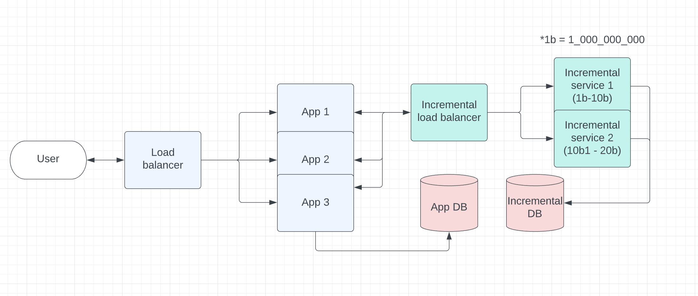

### Objective

#### **Prerequisites

- Ruby 3.0.1
- Rails 7.0.2.3
- MongoDB

### Demo:

[https://url-shortener-owarbv.herokuapp.com/apipie](https://url-shortener-owarbv.herokuapp.com/apipie "https://url-shortener-owarbv.herokuapp.com/apipie")

### Approach

To adapt the requirement shorten the url, we need to somehow transform the url to the unique short-key (6 chars) and store it into the database with short_key is the query key, source_url is the full url input by user.

Simple & the fastest solution is use md5 of the given URL and then only keep first 6 characters, However, this approach may have collision as some urls eventhough it has unique md5 but may have the same first 6 characters ==> can not choose this approach if the shortener service used by everyone in the world.

The real problem is how can the short_key can be unique. So let think of if we only can limit short_key length to the set of 6 chars, the character collection may variable from A-Z, a-z,0-9 (24 + 24 + 10 = 62 characters). Then we can have 62^6 different unique values. So if we can have the incremental engine that always given increase value to 1 every each request (call it `idx`), then have some encryption to transform that to mappable set of 6 characters, seems like `idx` from number base 10 can be convered to encoded in base 62. So all encoded request can have unique short_key. ==> This one make sense.

The final approach for this assignment is use MongoDB with 2 model:

- First collection only have 1 record (act as Incremental element), use optimistic locking to make sure there is no concurrent update, that record will increase `idx` field by 1 everytime it is called.
- Second collection called `url_shortener` store documents where each document is the encode request, encoded value will be stored into `short_key` field and the input url will be stored into `source_url` field

*** There are some another problem solving implemented for scalability eg: can have multiple incremental running the same time and each incremental handle in a defined range of increment (can only increase in scope of min..max value set in ENV), ... details can be explain later.

#### Scalability problem

Huge amount of user and request at the same time may always causing collision if using no transaction or bottle neck if the transaction is locked for a while. So to solve this we also need to scale the incremental as well. Below figure shows the system design for production and how service can be scaled up.

#### Security concern

Encoded base62 can be guessed and programatically crawling all possible source_url. For this, shuffle the 62base charset can be considered. Transform encryption algorithm can be apply to

### How to run the code:

- Install ruby 3.0.1 & bundler
- Clone the project & Change dir to root of the source code
- `bundle install`
- `cp config/application.yml.sample config/application.yml`
- modify `config/mongoid.yml` to match with your machine (if needed)
- `rake db:mongoid:create_indexes`
- `rails s`
- visit `http://localhost:3000`
- Api documentation located at `http://localhost:3000/apipie`

### Run spec

- `RAILS_ENV=test rake db:mongoid:create_indexes`
- `rspec`
